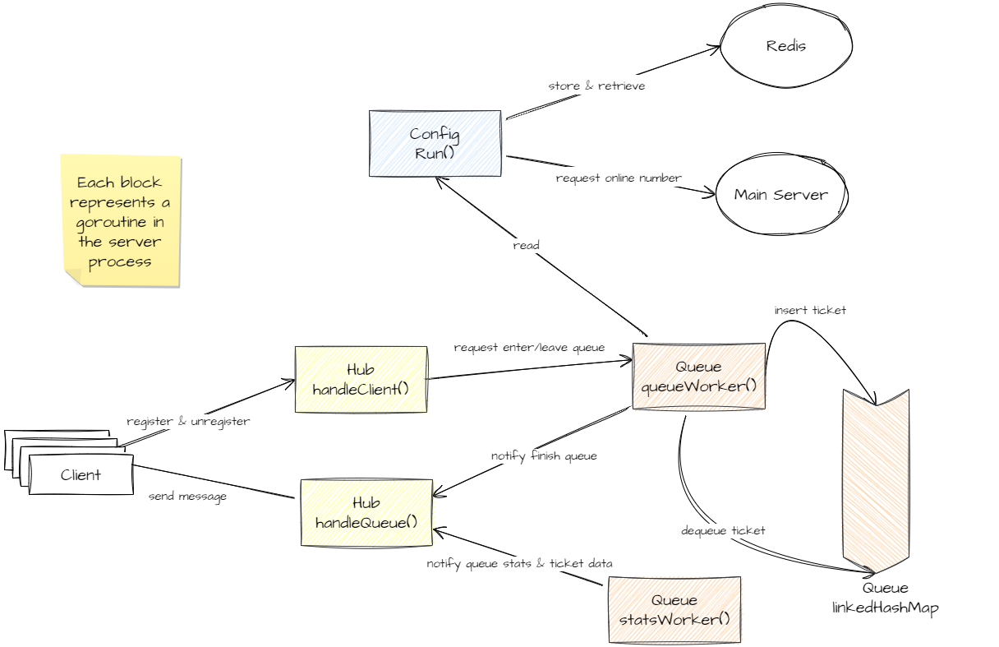
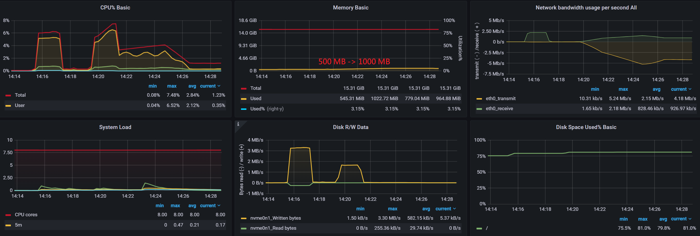
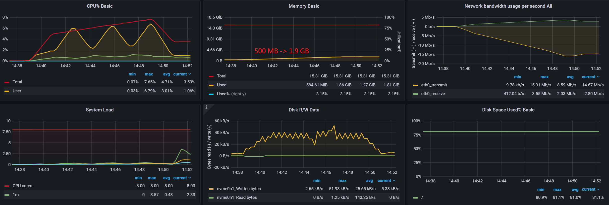
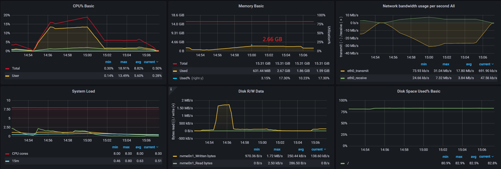
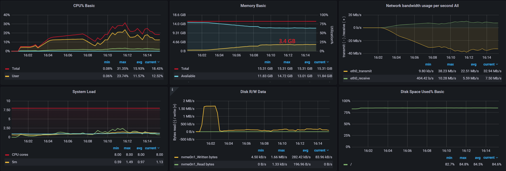
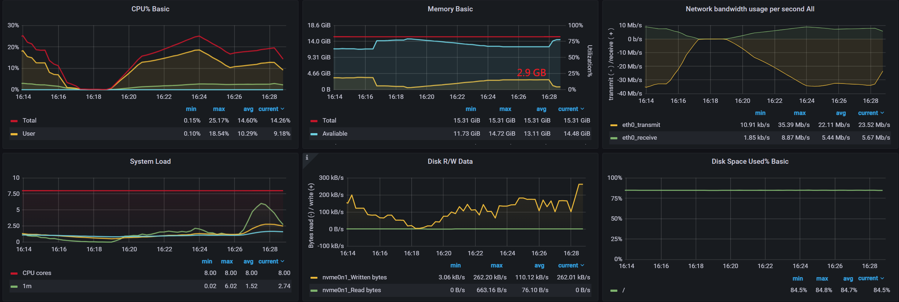
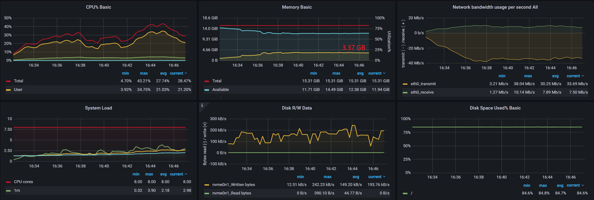

# joker-login-queue-server
A queue server written in Golang that queue client login requests to
avoid main server outrage. If user traffic surges, we need to protect
our main server. Queue server will read the user number that are
currently on main server and decide how much new user can login to
main server by dequeueing certain number of login requests out from
its queue. Works similar like a [token
bucket](https://en.wikipedia.org/wiki/Token_bucket).

It uses websocket protocol to communicate with frontend client and
http request additional data from main server. However, since queue
server stores client info in server-side memory, it's not possible to
scale this queue server to multiple machines. This is left for future
peformance optimization (**Not that easy**, would require centralized
message queue such as RabbitMQ).

## Prerequisites

First, ensure that you are using a machine meeting the following requirements:

- Have `docker` and `docker-compose` installed.
- Have a keyboard for you to type command.
- Chill enough.

## Installation
1. Set credential in the file `.env` and place it in project root
   directory. This file is read by docker compose:
    ```
        // Port of the queue server.
        SERVER_PORT="5487" 

        // Queue server need a redis instance to store data.
        REDIS_HOST="host.docker.internal:8787" 
        REDIS_DB="0"

        // The main server host and required api key to make request.
        MAIN_SERVER_HOST="http://host.docker.internal:8888" 
        MAIN_SERVER_API_KEY="d7153da6-aa6f-4a7b-9c30-a9fc92708bae"

        // Queue server tls certificate
        TLS_PRIVATE_KEY_PATH="deploy/certs/game-soul-swe.com/private.key" 
        TLS_CERT_PATH="deploy/certs/game-soul-swe.com/public.crt"

    ```
2. Put TLS certificate in `deploy/certs` directory. Remember to match the path you fill for `TLS_PRIVATE_KEY_PATH` and `TLS_CERT_PATH` for `.env`

Finally, run `docker-compose build` and `docker-compose up -d` to run the tool.

## API
See document [api](./docs/api.md)

## Brief overview on Archictecture
For more details, please read code comments.


## Exploration of Golang Library
This project also served as an expirimental project for us to explore
golang's feature and related framework:
- Dependency Injection [wire](github.com/google/wire)
- HTTP [echo](github.com/labstack/echo/v4)
- Websocket [gorilla websocket](github.com/gorilla/websocket)
- Logger [zap](go.uber.org/zap)
- Data Structure [gods](github.com/emirpasic/gods)
- Redis [redis](github.com/go-redis/redis/v8)

## Performance Test
Performance testing is important for this kind of server, since its
primary mission is to hold large amount of traffic that other server
cannot. We use [k6](https://k6.io/) to simulate large amount of client
traffic and try to perform both load testing and soak testing. Test
code can be found under `test` folder. In conclusion, the server can
handle at least **50000 CCU**.

### Machine Instance
We deployed our server on a c6g.2xlarge AWS EC2 instance. This type of
machine has 8vCPU and 16GB RAM.

### Simple Test
In this case, each client will connect to login queue server and
request login. After that, every client just hang there and the login queue does
not dequeue any ticket (no free slot). The whole test runs for 10~15 mins.

**10000 CCU**

**30000 CCU**

**50000 CCU**


### Dequeue Test
50000 client connection and server perdiocally deque
5000 clients and perform login for them. These dequeued clients will
connect back and request login again. Thus, CCU remains 50000 during
the test.


### Reconnect Test
50000 clients and each of them has a random session duration (1~10
min). After session ends, they will disconnect and reconnect again.


### Large DAU Test (Soak Test)
Same as Reconnect Test, but each client will provide an unique id when
reconnecting. Thus, the server will view each client connection as
different user. The session duration is also shorten to 1~3 min. The
whole test run for 15 min and completed 119100 DAU.

